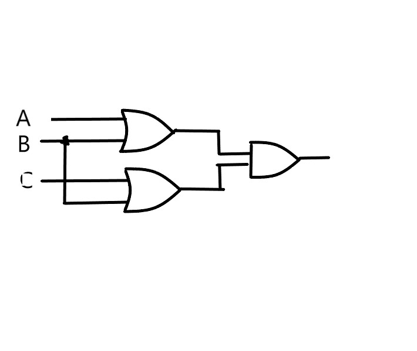
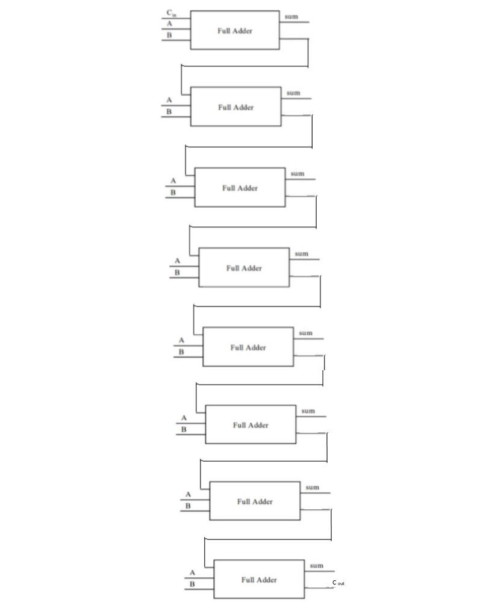

## 1. AND 
* Boolean Expression: A · B  
* Logic Diagram Symbol  

* Truth Table   

A|B|X
-|-|-  
0|0|0
0|1|0
1|0|0
1|1|1

AND 是一种可以判断两个输入的信号是否都为“1”的电路
## 2. XOR
* Boolean Expression:    

* Logic Diagram Symbol  

* Truth Table 

A|B|X 
-|-|-
0|0|0
0|1|1
1|0|1
1|1|0

## 3. (A+B)(B+C)

## 4. 

A|B|A'|AB|A'⊕(AB)
 -|-|-|-|-  
0|0|1|0|1  
1|0|0|0|0  
0|1|1|0|1  
1|1|0|1|1
## 5.

A|B|A'+B'|(AB)' 
 -|-|-|-  
0|0|1|1  
1|0|1|1  
0|1|1|1  
1|1|0|0
## 6.

## 7. 
* (X8X7X6X5X4X3X2X1)2 or (00001111)2 = (X8X7X6X51111)2
* (X8X7X6X5X4X3X2X1)2 xor (00001111)2 = (X8X7X6X5X4'X3'X2'X1')2
* ((X8X7X6X5X4X3X2X1)2 and (00001111)2) or (not (X8X7X6X5X4X3X2X1) 2 and (00001111)2) = (X8X7X6X5X4'X3'X2'X1')2

## 名词解释
* ### Logic gate  
In electronics, a logic gate is an idealized or physical device implementing a Boolean function; that is, it performs a logical operation on one or more binary inputs and produces a single binary output. 
* ### Boolean algebra
In mathematics and mathematical logic, Boolean algebra is the branch of algebra in which the values of the variables are the truth values true and false, usually denoted 1 and 0 respectively. 

## 1. Flip-flop 中文翻译是？
### 触发器
## 2. How many bits information does a SR latch store?
### 1bit
