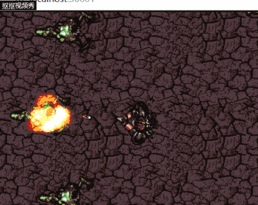

# 制作html5射击游戏 
* 成果展示 
  

## 准备
1. Construct2(Free)  
2. 图片  
  
 
  
  

## 开始
1. 建立一个新文件  
File-New-New empty project
2. 插入背景及角色  
双击中央空白处，进入插入界面，选择Tiled Background，点击空白处，弹出窗口。  
  
点击文件夹按钮，选择之前准备好的背景插入，之后在左侧的属性栏中改好位置和大小。  
  
之后在右侧的“ Layers ”中将背景对应的Layer 0 锁定并新建一个 Layer 并点击铅笔图标将其重命名为“ Main ”，之后点击“ Main ”以选取，我们将在其上插入角色。双击中央屏幕，在插入界面选取“ Sprite ”，然后采取与插入背景时相同的操作将角色、子弹、爆炸、怪物图片插入。将子弹和爆炸移动到布局边缘的某个位置，因为我们不希望在游戏开始时看到它们。方便寻找，我们在左侧的属性中将其重名为*Player，Bullet，Explosion和Monster*。  
  

## 为角色赋予生命
### 添加行为
首先，点击界面上已添加的角色图标，然后在左边属性栏中找到*Behaviors*，点击下方编辑按钮,在界面中双击 ***8 direction movement***  
  
相同地，我们添加 Scroll To 行为，使屏幕跟随角色，以及 Bound to layout 行为，以使它保持在布局中。  
此外，我们需要  
* 将 Bullet movement 和 Destroy outside layout 添加到Bullet
* 将 Bullet movement 添加到 Monster
* 将 Fade 添加到 Explosion （因此它逐渐消失）  
此时我们发现属性栏中出现了一些额外的属性，这允许我们调整行为的工作方式。将速度从 400 更改为 80。同样，将 Bullet 的速度更改为 600 ，将 Explosion 的 Fade 的时间更改为 0.5（即半秒）。  
很明显，一个 monster 是不够打的，此时我们按住键盘上的 Ctrl 并拖动 Monster ，就可以复制出很多。

## 让游戏动起来
首先，点击上方 Event sheet 以编辑活动事件,我们首先想到让玩家总是看着鼠标。双击空白部分，在界面中System - everytick - add action - player - Set angle towards position然后在 X 中填入 Mouse.X ,在 Y 中填入 Mouse.Y。同样地，我们依据自己的构思，使玩家开枪，使怪物碰壁后朝向玩家返回等等。然后我们在变量中赋予子弹伤害，玩家生命等等。一个简单的游戏就做好了。

* ####  参考资料[Beginner's guide to Construct 2](https://www.scirra.com/tutorials/37/beginners-guide-to-construct-2)

