## 目录  
#### 1. 实验目标  
#### 2. 实验步骤与结果  
* 任务一：简单程序；  
* 任务二：简单循环；  
#### 3. 实验小结

## 实验目标:
1. 理解冯·诺伊曼计算机的结构  
2. 理解机器指令的构成  
3. 理解机器指令执行周期  
4. 用汇编编写简单程序  

## 实验步骤与结果：
* #### 任务1：简单程序    
*（1）打开网页 The PIPPIN User’s Guide ，然后输入 Program 1：Add 2 number*
*（2）点 step after step。观察并回答下面问题：*  
1. **PC，IR 寄存器的作用。**  
PC：用来计数，指示下一步指令的位置（地址）  
IR：存放当前正在执行的指令
2. **ACC 寄存器的全称与作用。**  
ACC：(accumulator)存放计算产生的结果以便操作   
3.**用“LOD #3”指令的执行过程，解释Fetch-Execute周期。**   
(1) Fetch the next instruction: CPU读取PC寄存器中的指令地址0（指向指令LOD #3） 
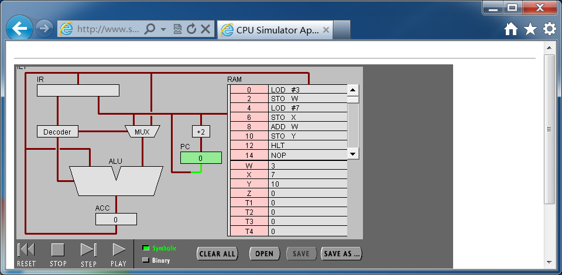   
(2) Decode the instruction：CPU读取指令LOD #3后存入IR并放入decoder中解码  
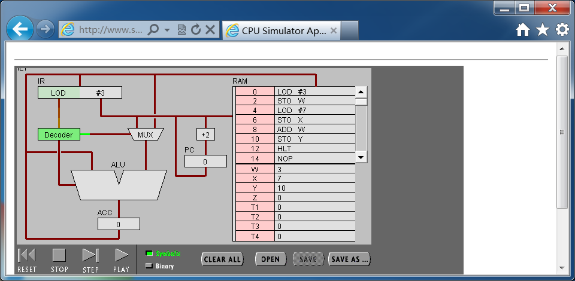  
(3) Get data if needed：解码后读取需要的数据，指令LOD #3则需要读取“3”  
  
(4) Execute the instruction：将读取的“3”放入ALU  
  
(5)将PC寄存器中的地址信息更改到下一指令（0+2=2），便于下一个周期开始。  
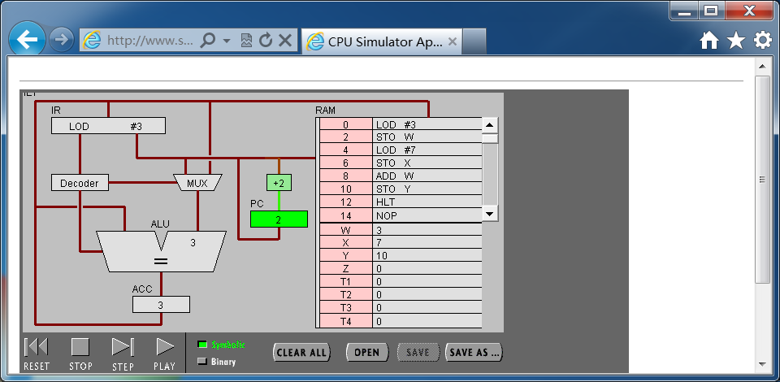  
4. **用“ADD W” 指令的执行过程，解释Fetch-Execute周期。**  
(1) Fetch the next instruction: CPU读取PC寄存器中的指令地址8（指向指令ADD W）  
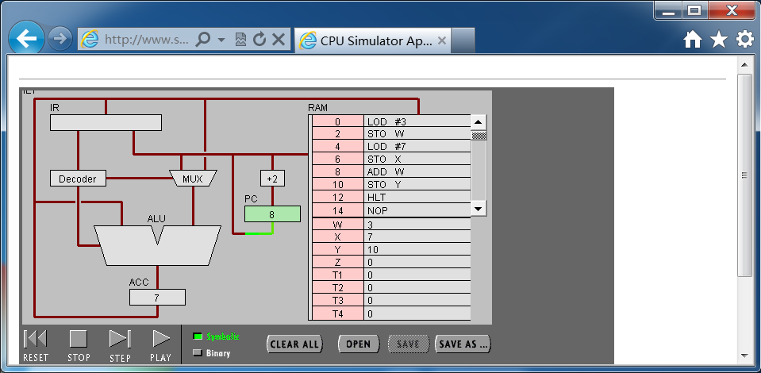  
(2) Decode the instruction：CPU读取指令ADD W后存入IR并放入decoder中解码  
  
(3) Get data if needed：解码后读取需要的数据，指令ADD W则需要读取W的值3与ACC中的值7  
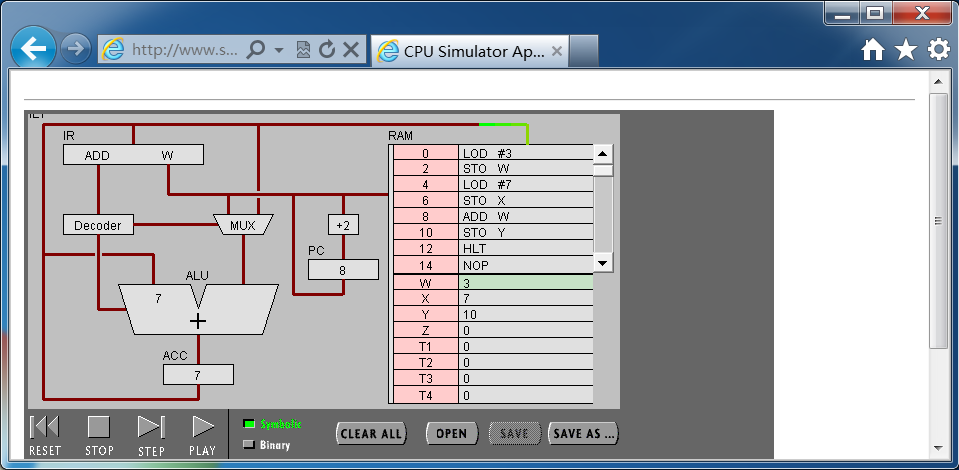  

(4) Execute the instruction：将读取的“3”与“7”放入ALU，并将二者相加得10，存入ACC  
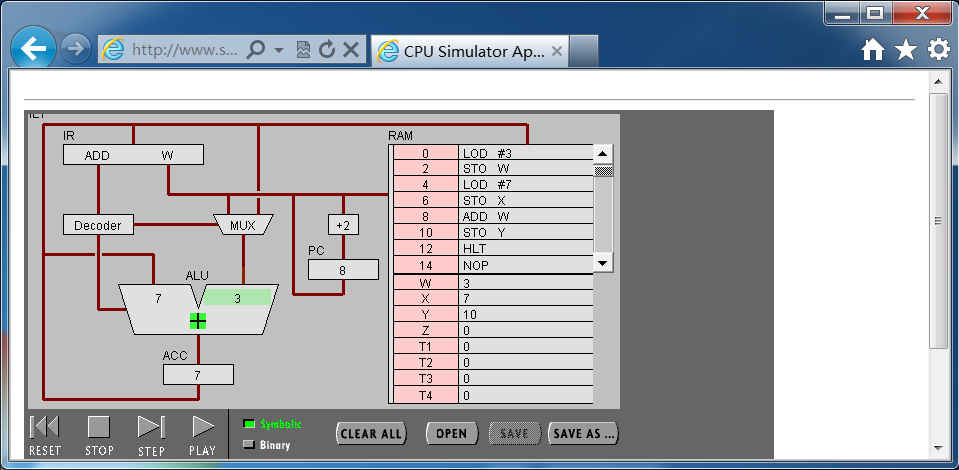
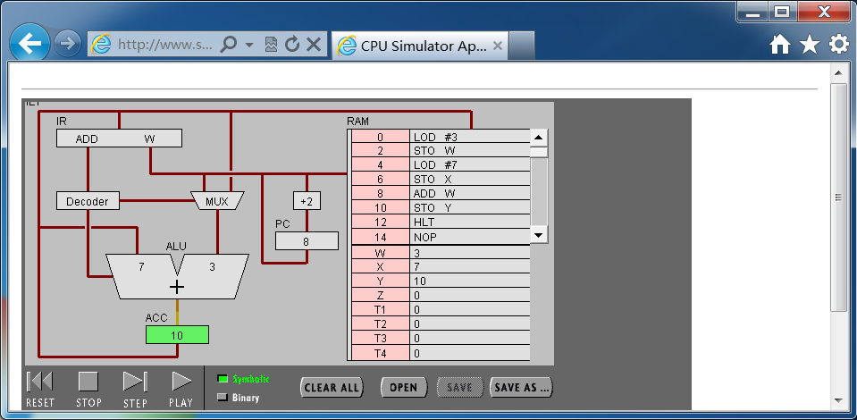    
(5)将PC寄存器中的地址信息更改到下一指令（8+2=10），便于下一个周期开始。    
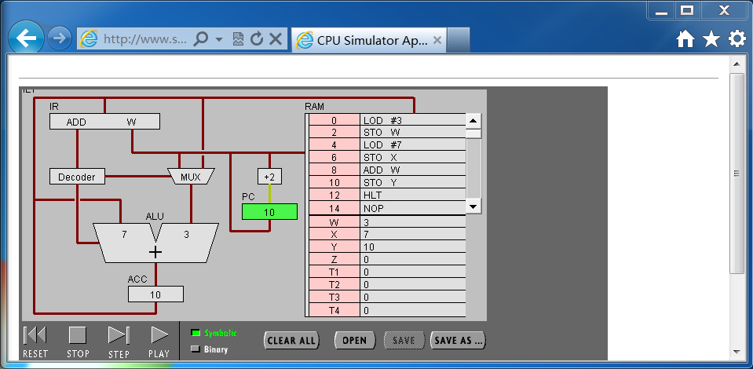  
5. **“LOD #3” 与 “ADD W” 指令的执行在Fetch-Execute周期级别，有什么不同。**  
	前者只是一个“承载3”的操作，只需要将3放入ALU，“Execute”环节较简单；  后者则是一个相加的操作，需要将值放入ALU并进行计算，步骤较前者多，还复杂。  
*（3）点击“Binary”,观察回答下面问题*  
1. **写出指令 “LOD #7” 的二进制形式，按指令结构，解释每部分的含义。**  
二进制形式：00010100 00000111  
前四位“0001”：表示操作数是数值  
第五位到第八位“0100”：操作码，代表“LOD #n”操作  
后八位“00000111”：数值7的二进制形式  
2. **解释 RAM 的地址。** 
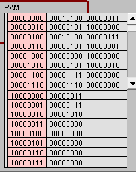   
	上半部分是各个指令的地址  
	下半部分是各个变量的地址  
3. **该机器CPU是几位的？（按累加器的位数）**  
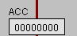  
如图，CPU为8位  
4. **写出该程序对应的 C语言表达。**  
Int main(){  
	Int x,w,y;  
	w = 3;  
	x = 7;  
	y = x + w;  
	return 0;  
}  
* #### 任务2：简单循环  
*（1）输入程序Program 2，运行并回答问题：*
1. **用一句话总结程序的功能**  
将一个数不断减去1直至这个数为1  
2.	**写出对应的 c 语言程序**  
Int main(){  
		Int x = 3;  
		While(x - 1 != 0){  
			x--;  
			}  
		return 0;  
	}  
*（2） 修改该程序，用机器语言实现 10+9+8+..1 ，输出结果存放于内存 Y。*  
1. **写出 c 语言的计算过程**  
int main(){  
		int x,y = 0;  
		for(x = 10;x > 0;x--)  
			y = y + x;  
		return 0;  
}  
2.	**写出机器语言的计算过程**  
如图（因为x会在第一次循环减去1，所以将x初始值设置为11）  
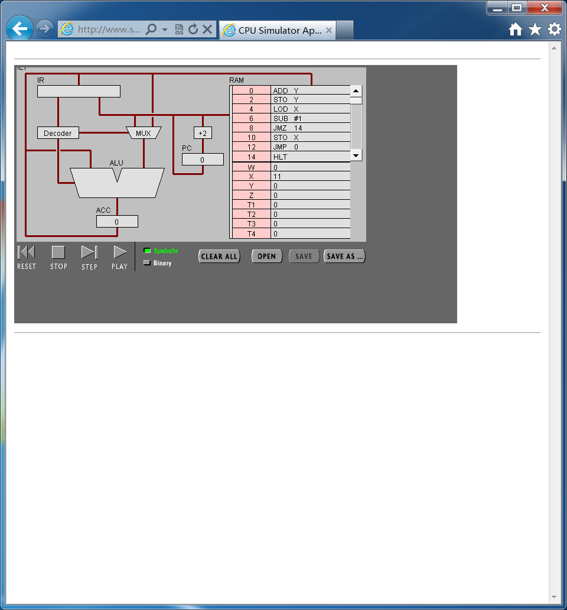  
  
(结果为55)  
3.	**用自己的语言，简单总结高级语言与机器语言的区别与联系。**  
区别：高级语言具有较好可读性但机器无法读懂；机器语言由“0”、“1”组成，机器可以读懂，但对于人来说可读性较差。  
联系：高级语言的实现，是通过将高级语言翻译为机器语言输入机器来完成的。  
## 实验小结：
1.	初步理解了冯·诺伊曼计算机的结构，通过对CPU Simulator的使用，了解了CPU运行的基本原理，寄存器、解码器、逻辑计算单元的配合；看到了将指令储存器和数据储存器置于一起的结构。  
2.	理解了机器指令的构成：四位寻址模式+四位操作码+八位数值或内存地址。  
3.	通过对两个指令“LOD #3”与“ADD W”执行过程的实践与分析，看到了机器指令执行周期的进行方式。  
4.	成功用汇编语言编写简单程序（计算10+9+8+…+1的值并存入一个内存单元）。  

