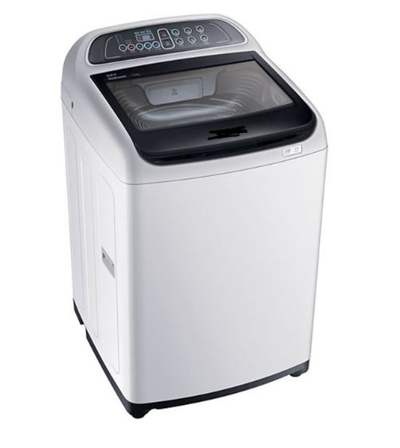

# “自顶向下，逐步求精”的编程方法  
在我们的编程生涯中，不仅会遇到“ Hello world ”这样的简单的任务，有时也会遇到非常繁杂的任务，这样的任务就像一个浩大的工程，很难直接拿下，此时就需要一些将任务分解为一个个简单的小任务的方法，今天我们介绍的“自顶向下，逐步求精”的编程方法就是这样的一种方法。  
## 定义
 （来源：wikipedia ）
>A top-down approach (also known as stepwise design and in some cases used as a synonym of decomposition) is essentially the breaking down of a system to gain insight into its compositional sub-systems in a reverse engineering fashion. In a top-down approach an overview of the system is formulated, specifying, but not detailing, any first-level subsystems. Each subsystem is then refined in yet greater detail, sometimes in many additional subsystem levels, until the entire specification is reduced to base elements.   

## 方法  
1. 设计出一个总体的系统
2. 将总系统按照一定的方式分解为一个个子系统
3. 进行子系统的详细设计
4. 通过总系统调用子系统，来实现编程的目标  

## 核心
“**自顶向下**”：从顶端（总体）往底端（分支）进行设计  
“**分解**”：将任务分解  
“**可实现性**”：分解后生成的任务要可以被简单完成

## 实际应用举例
### 洗衣机算法设计


### 1. 任务设计 + 分解  
洗衣过程 = 注水 + 浸泡 + 洗涤 / 漂洗 + 脱水 + 停机；  
```
    选择洗衣模式；  
    注水；
    加入洗衣液；
    浸泡；
    循环    电机顺时针旋转；  
            电机逆时针旋转；
    排水；
    脱水；
    关机；
```

### 2. 子任务实现（伪代码）  
* 注水  
```
INPUT mode;//模式决定水位，时间等条件

    WHILE(water < modeWater)
        water_in_switch(open)
        get_water_volume() 
        IF(water > modeWater)
            water_in_switch(close)
        END IF
    END WHILE
```
* 浸泡 
```
    WHILE(timeCounter > 0)
        timeCounter--
    END WHILE
```
* 洗涤 / 漂洗 
```
    WHILE(RotateTime > 0)
        motor_run(left) 
        motor_run(right)
        RotateTime = RotateTime - 1
        time_counter()
```
* 脱水 
```
    WHILE(water > 0)
        water_in_switch(open)
        get_water_volume()
    END WHILE    
    water_in_switch(close)

    WHILE(RotateTime > 0)
        motor_run(left) 
        motor_run(right)
        RotateTime = RotateTime - 1
        time_counter()
```
* 停机  
```
    halt(returncode)
```
-------
就这样，平时我们常用的洗衣机就基本被我们设计出来了，使用了“自顶向下，逐步求精”的编程方法，是不是发现看似很难的任务也是可以被“逐个击破”的，希望本篇文章对你有帮助，也希望大家可以熟练使用该方法来提升自己的编码能力。


