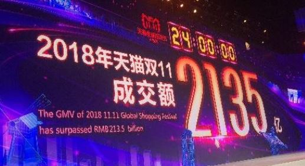

# 风险投资与IT的发展
很多人都听说过“风险投资”这个名词，并且或多或少有一些了解，但如果你细细研究一下“风投”这个行业，你就会发现它在生活中无处不在，很多投资行为都有它的影子。本篇文章中，我们主要讲述一些风险投资与IT行业发展之间的故事。
  
## 什么是“风投”  
要想了解风投，首先得了解什么是风投，根据[百度百科](https://baike.baidu.com/item/%E9%A3%8E%E9%99%A9%E6%8A%95%E8%B5%84/154499?fr=aladdin)定义：
>风险投资（英语：Venture Capital，缩写为VC）简称风投，又译称为创业投资，主要是指向初创企业提供资金支持并取得该公司股份的一种融资方式。风险投资是私人股权投资的一种形式。风险投资公司为一专业的投资公司，由一群具有科技及财务相关知识与经验的人所组合而成的，经由直接投资获取投资公司股权的方式，提供资金给需要资金者（被投资公司）。风投公司的资金大多用于投资新创事业或是未上市企业（虽然现今法规上已大幅放宽资金用途），并不以经营被投资公司为目的，仅是提供资金及专业上的知识与经验，以协助被投资公司获取更大的利润为目的，所以是一追求长期利润的高风险高报酬事业。  

正如上述所说的一样：风险投资是一项**不以经营被投资公司为目的**（与平常所见投资类型的一大区别所在），**长期利润**，**高风险高报酬**的事业，一旦投资失败，可能会赔的血本无归，可以称之为“投资界的赌博”，这也正是风险投资的魅力所在。

## IT 发展与风投
一家 IT 企业被“风投”公司看中，很多时候是因为其创始人有着出色的技术 / 开发出了吸引人的产品，但公司能否得到妥善的管理，产品能否顺利进入市场并盈利等等不确定因素使风投具有极大的风险，尽管风险投资家很多有专业的管理知识与技术背景，但仍不能改变其高风险的事实。让我们从近年来的一些风投实例来了解风投的实质。

## 1. 软银的成功——阿里巴巴
相信不少人都在“11.11”的时候“剁手”，而伴随着阿里的发展，双十一的交易额也是连年创造新高，可以说，阿里（淘宝）称霸着中国的网购市场，马云也是依靠阿里赚的盆满钵满。   
  
但在1999年，阿里创立之时，它还并没有显示出如今这般实力，但在 2001 年，它受到日本风险投资公司软银的青睐，接受了软银的一大笔融资（风投），如果阿里没有在日后腾飞，那这笔投资很可能会打水漂，但时间证明，正是这次投资，不仅帮助了阿里公司的发展，同时也为软银栽下了一棵“摇钱树”，并且如今它正年年从其上得到巨大回报。  
正如文章[阿里巴巴对软银到底有多重要？](http://www.sohu.com/a/237375281_99942958)所说，阿里是软银“不停工作的印钞机”，可以说，软银对阿里的投资，实现了双赢，也是风险投资行业的一大成功。  

## 2. 尚阳科技的悲剧  
尚阳科技成立于 2003 年，成立之初就获得多家大企业的投资，其中包括有华登投资、DCM、IntelCapital等知名企业，管理阵容也是很强大，创办人是网通曾经的首席运营官郑昌幸，管理者里还有华为高管陈硕和毛森江。巨大的首轮融资额，豪华的投资团队，种种优势也没能从危难中拯救它，不到三年就因为经营不善陷入困境，之后其希望通过转型度过寒冬，但均宣告失败。  
其失败的原因众说纷纭，有人说是因为没有有竞争力的产品，有人说是公司内部破裂，各自为战，但不可否认的是，那些进入尚阳的风险投资基本都宣告失败，并且很难有收回来的可能。  

## 小结  
风险投资到如今依然火爆，时不时都会有某知名风投公司向某新兴企业融资的消息传出，然而在其光鲜亮丽的表面背后，隐藏着许多不为人知的悲剧。哈佛商学院的高级讲师 Shikhar Ghosh认为风投就是：
>“大声宣扬好的，偷偷埋掉死的。”  

不是每一笔风险投资都可以投向下一个“BAT”，有很多“尚阳科技”存在于风险投资这一行业之中。不为风投表面的光鲜所诱惑，多了解一些事实，我们才能看到行业的实质，从中吸收对我们有益的东西。
 