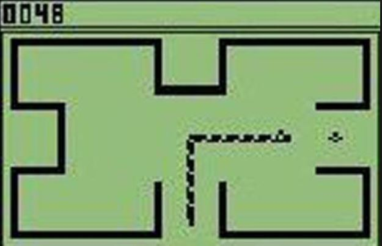
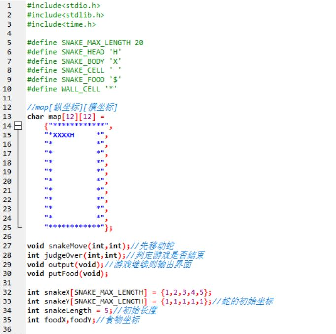
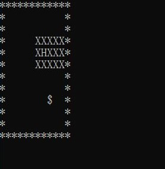

# C语言实现智能蛇  

提到贪吃蛇，应该很多人都会想到当年在非智能机上不断的挑战新纪录的日子，如今已是8102年，各种各样奇异的贪吃蛇涌现出来，而我们也可以利用自己已学习到的C语言来制作一条可以自己吃东西的蛇——智能蛇  

##### 经典的非智能机上的贪吃蛇

### 操作环境 Linux（Ubuntu）
### 编译工具 gcc

### 1. 贪吃蛇  
在实现智能蛇之前，我们必须先制作基本的贪吃蛇游戏（以下部分是在windows上使用dev完成的）   
贪吃蛇虽然说是一款小游戏，但也不是可以一蹴而就的，所以我们使用自顶向下的分析方法将任务分解：  
1. 拥有一个可以让蛇在上面跑的地图    
2. 在地图上放置一条蛇  
3. 让蛇可以合理的移动
4. 判定蛇是否死亡  
5. 在地图的空位放置食物  
6. 让蛇在吃掉食物之后变长  

产生如下伪代码
```
	输出字符矩阵
	WHILE not 游戏结束 DO
		ch＝等待输入
		CASE ch DO
		‘A’:左前进一步，break 
		‘D’:右前进一步，break    
		‘W’:上前进一步，break    
		‘S’:下前进一步，break    
		END CASE
		输出字符矩阵
	END WHILE
	输出 Game Over!!! 
```

于是我们产生了下面的程序头部  
   
然后分步实现  
首先进行最难也是最重要的一步——如何根据输入使蛇进行移动：  
```
void snakeMove (int x,int y){
	int i;
//首先判断移动是否合理
	if(snakeX[snakeLength - 1] + x != snakeX[snakeLength - 2]||snakeY[snakeLength - 1] + y != snakeY[snakeLength - 2]){
		for(i = 0;i < snakeLength - 1;i++){
			map[snakeY[i]][snakeX[i]] = SNAKE_CELL;
			snakeX[i] = snakeX[i + 1];
			snakeY[i] = snakeY[i + 1];
		}//move body
		map[snakeY[snakeLength - 1]][snakeX[snakeLength - 1]] = SNAKE_CELL;
		snakeX[snakeLength - 1] += x;
		snakeY[snakeLength - 1] += y;
		map[snakeY[snakeLength - 1]][snakeX[snakeLength - 1]] = SNAKE_HEAD;//move head
		for(i = 0;i < snakeLength - 1;i++){
			map[snakeY[i]][snakeX[i]] = SNAKE_BODY;
		}
	
	} 
}
```
**这个函数的核心思想是先清理掉已有的蛇，改变蛇各部分的坐标，然后根据新的坐标放一条新的蛇上去，从而造成“蛇在不断移动”的假象**  
接下来，实现其它函数
```
int judgeOver(int x,int y){
	if(x > 0&&x < 11&&y > 0&&y < 11)//判断蛇头位置就行
		return 1;
	else 
		return 0;
}

void putFood(void){
	srand(time(NULL));

    foodX = rand()%12;
    foodY = rand()%12;//利用srand(),rand()随机产生坐标 
    if(map[foodY][foodX] == ' ')
    	map[foodY][foodX] = SNAKE_FOOD;
}

void output(void) {
    int i, j;
    for (i = 0; i < 12; i++) {
        for (j = 0; j < 12; j++)
            printf("%c", map[i][j]);
        printf("\n"); 
    }
}
```
然后就是用来调用这些函数的主函数了
```
int main(){
	char move,c; 
	int flag = 1;//游戏结束则变flag为0 
	putFood();
	while(flag){		
		output();		
		move = getch();				
		switch(move){
			case 'a': 
				snakeMove (-1, 0);
				break;
			case 's':
				snakeMove (0, 1);
				break;
			case 'd':
				snakeMove (1, 0);
				break; 
			case 'w':
				snakeMove (0, -1);
				break;
			}
//蛇头与食物相撞后蛇加长，重新放置食物 			
		if(snakeX[snakeLength - 1] == foodX&&snakeY[snakeLength - 1] == foodY){
			snakeY[snakeLength] = snakeY[snakeLength-1];
			snakeX[snakeLength] = snakeX[snakeLength-1];
			snakeLength++;
		}
		if(snakeLength == SNAKE_MAX_LENGTH){
			printf("snake long enough!\n");
			break;
		}					
		if(map[foodY][foodX] != SNAKE_FOOD)
			putFood();
				
		system("cls");
		flag = judgeOver(snakeX[snakeLength - 1],snakeY[snakeLength - 1]);		
	} 
	printf("Game Over!\n");
}
```
为了更好的体验，我们使用getch()（而不是getchar）函数来避免输入一个字符按一下回车的情况，使用system("cls")清屏函数来清除掉上一次操作后的图像  
完成了以上内容，我们就可以通过自己操作来快乐玩耍了。  
***********
### 2. 有了以上铺垫，我们进入正题——智能蛇的实现：  
首先，我们得学会利用linux执行之前在windows写好的程序  
1. 我们用printf("\033[2J")代替清屏函数system("cls")
2. 我们通过将程序融入下面给出的程序实现getch()，即无阻塞输入  
[Linux下非阻塞地检测键盘输入的方法](http://bbs.chinaunix.net/thread-935410-1-1.html)  

之后我们进入正题，还是和之前一样，我们将任务进行分解：  
1. 判断哪些方向可以走  
2. 计算每种走法后蛇头和食物的距离
3. 挑选出最合适的走法    
产生如下伪代码  
```
    // Hx,Hy: 头的位置
    // Fx,Fy：食物的位置
	function whereGoNext(Hx,Hy,Fx,Fy) {
	// 用数组movable[3]={“a”,”d”,”w”,”s”} 记录可走的方向
	// 用数组distance[3]={0,0,0,0} 记录离食物的距离
	// 分别计算蛇头周边四个位置到食物的距离。H头的位置，F食物位置
	//     例如：假设输入”a” 则distance[0] = |Fx – (Hx-1)| + |Fy – Hy|
	//           如果 Hx-1，Hy 位置不是Blank，则 distance[0] = 9999
	// 选择distance中存最小距离的下标p，注意最小距离不能是9999
	// 返回 movable[p]
	}
```
利用函数实现这些任务
```
char nextStep(char Hx,char Hy,int Fx,int Fy){
	int distance[3],i,counter = 0,mark;
	char direction[4] = {"asdw"},moveable[3];
	char cantMove[3];
	judgeCantMove(cantMove);
	char move;
	
	for(i = 0;i < 4;i++){
		if(direction[i] == cantMove[0]||direction[i] == cantMove[1]||direction[i] == cantMove[2]){
			continue;
		}
		else{
			moveable[counter] = direction[i];
			printf("%c\n",moveable[counter]);
			counter++;
		}
	}
	
	for(i = 0;i <= counter;i++)
		distance[i] = computeDistance(moveable[i],Hx,Hy,Fx,Fy);
		
	mark = findNearest(distance,counter);
	return moveable[mark];
}

void judgeCantMove(char* cantMove){
	int i,n = 0;
	for(i = 0;i < snakeLength - 1;i++){	
		if(snakeX[snakeLength - 1] - snakeX[i] == 1&&snakeY[snakeLength - 1] - snakeY[i] == 0){
			cantMove[n] = 'a';
			n++;			
		}
		else if(snakeX[snakeLength - 1] == 1){
			cantMove[n] = 'a';
			n++;			
		}
		if(snakeX[snakeLength - 1] - snakeX[i] == 0&&snakeY[snakeLength - 1] - snakeY[i] == -1){
			cantMove[n] = 's';
			n++;			
		}
		else if(snakeY[snakeLength - 1] == 10){
			cantMove[n] = 's';
			n++;			
		}
		
		if(snakeX[snakeLength - 1] - snakeX[i] == -1&&snakeY[snakeLength - 1] - snakeY[i] == 0){
			cantMove[n] = 'd';
			n++;			
		}
		else if(snakeX[snakeLength - 1] == 10){
			cantMove[n] = 'd';
			n++;			
		}
		if(snakeX[snakeLength - 1] - snakeX[i] == 0&&snakeY[snakeLength - 1] - snakeY[i] == 1){
			cantMove[n] = 'w';
			n++;			
		}
		else if(snakeY[snakeLength - 1] == 1){
			cantMove[n] = 'w';
			n++;			
		} //防止撞到身体&防止撞墙 						
	}	
}
int computeDistance(char x,int Hx,int Hy,int Fx,int Fy){
	int nextX,nextY,distance;
	switch(x){
		case 'a': 
			nextX = Hx - 1;
			nextY = Hy;
			break;
		case 's':
			nextX = Hx;
			nextY = Hy + 1;
			break;
		case 'd':
			nextX = Hx + 1;
			nextY = Hy;
			break; 
		case 'w':
			nextX = Hx;
			nextY = Hy - 1;
			break;
		}	
	distance = abs(Fx - nextX) + abs(Fy - nextY);
	return distance;
}
int findNearest(int d[],int n){
	int i,m,flag;
	for(i = 0;i < n;i++){
		flag = 0;
		for(m = 0;m < n;m++)
			if(d[i] > d[m])
				flag = 1;
		if(flag == 0)
			return i;
	}		
}
```  
然后，我们只需要使move = nextStep（将函数返回值代替人工输入值），即可实现“智能蛇”。

### 3. 游戏创新（障碍物设置）的实现  
1. 障碍物设置：只需要在前面初始二维数组地图里加入一些“****”来代替墙
2. 使蛇不能撞到新设置的障碍物：在judgeOver函数中做修改，判断方式同理
3. （智能蛇程序）在judgeCantMove函数中加入对障碍物的判断  

完成以上内容，我们就可以往贪吃蛇游戏里加入障碍物了。

最后，不得不提的是该智能蛇还有很多漏洞，简单的距离判断无法避免各种各样情况的出现，实现“智能”确实不是容易事，以后的代码之路亦是如此，成功的程序往往需要大量的完善工作，为之付出才能有回报。  
  
（附上一条将自己困死的智能蛇）

