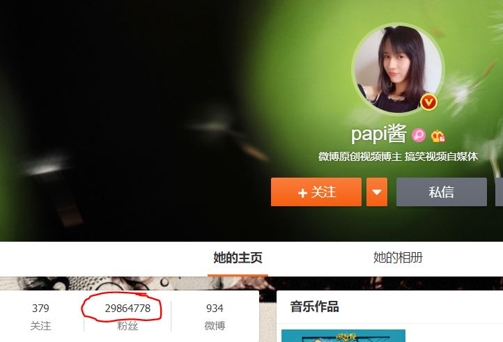

# 互联网商业价值之流量变现  
近年来，互联网时代的到来，使得大部分人们的生活都无法离开互联网，而在互联网的大潮中，一个词似乎在其中确立了其核心地位————“流量”，而“流量为王”也成为互联网时代一大主题。  

## 什么是流量？  
在我们讨论流量为什么在实现互联网时代这么“威风”之前，首先来了解一下什么是“流量”  
>流量(网络信息技术名词)，指在规定期间内通过一指定点的车辆或行人数量，在网络指在一定时间内打开网站地址的人气访问量，或者是手机移动数据的通俗意思。（引用自百度百科）  

我们在这里讨论的流量，则主要指第二种，换种简单的说法，就是**用户访问数量**。  

## 互联网盈利——流量如何变现  
我们首先来看一个例子，相信很多人都认识“PAPI酱”，通过她制作的搞笑视频，在网络上赢得了大量粉丝，在拥有大量“流量”之后，她开始了自己的“变现”之路，2016年4月21日，papi酱与罗辑思维创始人罗振宇、杨铭等合伙人以2200万卖出其第一次广告进行拍卖；同年3月，papi获得1200万元融资。

  
##### 可以看到，其微博粉丝已达到300w（2018/12）  

显而易见，“流量变现”最直接的方式就是**广告投放**，之前，我们在地铁站、公交站等地方见到的广告，是行人流量变现的方式，如今，我们在微信公众号、网站、微博等互联网平台见到的广告就是互联网流量变现的方式，你在互联网的“观众”有多少将直接影响到你在互联网上的价值有多大。  

### BAT 为何如此强大？
在中国，说起互联网，无疑会想到“三巨头”——百度，阿里，腾讯（BAT），他们能“称霸”，一大原因，就是他们拥有着绝大多数的互联网流量，即使腾讯能从游戏行业获得一笔可观的收入，但其主要利润来源依然是流量变现。  
拿阿里来举例，2009年11月11日，阿里自己举办了促销活动“双11”，在促销力度不大，参与商家数量有限的情况下，营业额远远超出预期。于是，电商市场被引爆，各路商家争着在其中寻求立足之地，但要想要获得收入，和线下实体店原理一样，需要有顾客进入自己的店铺，它们需要被消费者发现，于是，购买流量成为一大选择，辅助以低价，将自己的店铺推到前面，推到首页，从而获得大量的营业额，而此时，阿里无疑已赚到盆满钵满。
而腾讯、百度无疑是一个道理，大量的用户，使得他们的每一条广告都可以开出高价，而成本只是一些服务器的运营维护费用，堪称暴利。  
离开这些巨头，你会发现类似的盈利模式渗透在互联网的每一个角落：盗版软件捆绑着广告，各种导航网站的首页，去哪儿、携程等软件的酒店机票广告，“网红经纪”的出现，皆离不开流量。
## 流量争夺已成为“战争”  
在流量如此值钱的情况下，对流量的抢夺也自然成为一大重点。  
### 搜索引擎广告匹配
我们都有过类似的体验：在百度搜索一些关键词过后，页面之上的文章、广告将大部分与之相关，这就是一种搜索引擎进行用户需求探索的方式，然后通过针对性的满足用户需求，来留住自己的用户，留住自己的流量
### 挖角“大流量”  
此前今日头条通过开出客观的薪水来从知乎挖走一大批“大V”，让他们将自己创作的内容在今日头条独家发布，从而将其阅读者吸引过来，来为自己赢得流量。  
### 各种网卡的推出   
最近，各大互联网巨头纷纷推出自己的专属手机卡，通过“免流量”来吸引使用者，“腾讯大王卡”、“百度神卡”，或者是一些专属套餐，例如“网易云音乐畅听包”，这些方式虽然能满足一些有特定需求用户的需要，看似实在为用户谋福利，但事实上，如果你买了这类产品，大部分情况下，你将只使用其自家的产品，实则是将自己的流量牢牢绑在自己的身上。比如你购买了“腾讯大王卡”，你将只玩一些腾讯游戏，只用qq音乐听歌，只用腾讯视频看电影，从此成为腾讯流量中的“常客”。   
### “流量下乡”  
如今，乡下经济在一步步增长，“乡下人”也渐渐不再是贫穷的代名词，伴随着互联网逐步进入乡村，各大巨头也不会放弃商机，开始了“流量下乡”之路，开始在这批互联网的新客人之间争夺流量。  

##### （图源搜狐）各种各样的广告出现在乡下

## “流量为王”这个主题是否会永恒？
虽然流量是盈利的一大途径，但流量毕竟不是真正具有竞争力的东西，而且激烈的流量战已经带来诸多负面影响，大量产品及假货的出现与高昂的流量费用有直接的关系，大量商家在流量争夺中两败俱伤，而将重点放在产品吸引力上，而不是产品的质量上，受害的无疑是诸多互联网用户，而一旦用户不再买帐，流量盈利的时代也会被终结。人名日报曾对此事发表看法：“‘内容为王’永不过时。”纵然流量的增长有助于互联网的普及与发展，但我们不应舍本逐末，一昧的追求流量的增长以盈利，要认识到，好的产品质量才是硬道理。

#### 参考资料  
[百度百科](https://baike.baidu.com/item/%E6%B5%81%E9%87%8F/13386853)  
[流量战争：中国互联网的新一轮上山下乡运动](https://baike.baidu.com/tashuo/browse/content?id=3bad0e02c5a36a4dcbee90ef&lemmaId=&fromLemmaModule=pcBottom)  
[巨变来临，互联网盈利新模式：流量变现](https://www.sohu.com/a/166440076_740431)  
[人民日报："流量为王"不可取](http://media.people.com.cn/n1/2018/0504/c40606-29964056.html)  